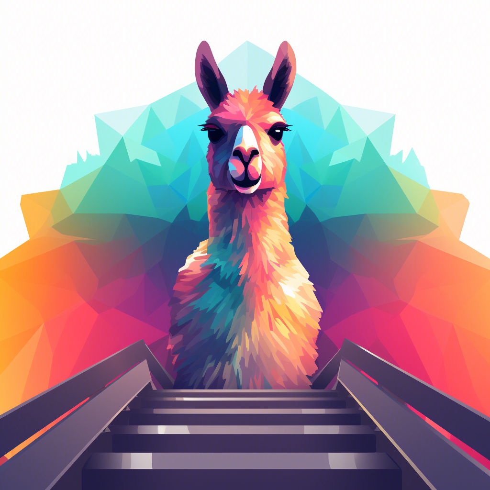

[comment]: <> ([![Stargazers][stars-shield]][stars-url])

[comment]: <> ([![Issues][issues-shield]][issues-url])

[comment]: <> ([![MIT License][license-shield]][license-url])


<!-- PROJECT LOGO -->
<br />

<div align="center">
  <a href="https://github.com/OPPOMKLab/u-LLaVA">
    
  </a>

<h3 align="center">u-LLaVA: Unifying Multi-Modal Tasks via Large Language Model</h3>

  <p align="center">
    Multi-modal multi task LLM
    <br />
    <a href="https://github.com/OPPOMKLab/u-LLaVA"><strong>Explore the docs »</strong></a>
    <br />
    <br />
    <a href="https://github.com/OPPOMKLab/u-LLaVA">View Demo</a>
    ·
    <a href="https://github.com/OPPOMKLab/u-LLaVA/issues">Report Bug</a>
    ·
    <a href="https://github.com/OPPOMKLab/u-LLaVA/issues">Request Feature</a>
  </p>
</div>


<!-- TABLE OF CONTENTS -->

<details>
  <summary>Table of Contents</summary>
  <ol>
    <li>
      <a href="#about-the-project">About The Project</a>
      <ul>
        <li><a href="#features">Features</a></li>
      </ul>
    </li>
    <li>
      <a href="#getting-started">Getting Started</a>
      <ul>
        <li><a href="#requirements">Requirements</a></li>
        <li><a href="#datasets">Datasets</a></li>
        <li><a href="#training">Training</a></li>
        <li><a href="#evaluation">Evaluation</a></li>
      </ul>
    </li>
    <li><a href="#license">License</a></li>
    <li><a href="#citation">Citation</a></li>
    <li><a href="#acknowledgments">Acknowledgments</a></li>
  </ol>
</details>


<!-- ABOUT THE PROJECT -->

## About The Project
Structure:

<div align="center">
    
</div>


Examples
<div align="center">
    
</div>

<div align="center">
 
</div>

<div align="center">
 
</div>


<p align="right">(<a href="#readme-top">back to top</a>)</p>

Demo is coming soon.

<!-- Features -->

## Features

- [x] Visual Understanding
  - [x] Image Captioning
  - [x] Video Captioning
  - [x] Visual Question Answering (VQA)
- [x] Visual Segmentation
  - [x] Referring Expression Segmentation (RES)
  - [x] Salient Object Segmentation
  - [x] Semantic Segmentation
- [x] Visual Grounding
    - [x] Referring Expression Comprehension (REC)

<p align="right">(<a href="#readme-top">back to top</a>)</p>

<!-- GETTING STARTED -->

## Getting Started

This is an example of how you may give instructions on setting up your project locally.
To get a local copy up and running follow these simple example steps.

<!-- Requirements -->

### Requirements

Run the following commands in terminal:
```shell
pip install -r ./shells/requirements.txt
cd ./models/GroundingDINO && ./install.sh && cd ../..
```
And please should install requirements of GroundingDINO for Grounding. Otherwise, you can disable grounding module.

Why do these?
1. install requirements: `pip install -r requirements.txt`
2. build cuda core for GroundingDINO: `cd ./models/GroundingDINO && ./install.sh && cd ../..`, 
    if not may arise `UserWarning: Failed to load custom C++ ops. Running on CPU mode Only!
    warnings.warn("Failed to load custom C++ ops. Running on CPU mode Only!")`

<!-- Datasets -->

## Datasets

**Annotation download link**: [ullava modified annotations][ullava_database], [LLaVA pretrain annotations][https://huggingface.co/datasets/liuhaotian/LLaVA-CC3M-Pretrain-595K/blob/main/chat.json] and [LLaVA finetuning annotaions][https://huggingface.co/datasets/liuhaotian/LLaVA-Instruct-150K]

**Image storage** (download link can be found in the table):

```
image_root
├─ade20k
│  ├─annotations
│  └─images
├─coco2014
│  ├─test2014
│  ├─train2014
│  └─val2014
├─coco2017
│  ├─annotations
│  ├─train2017
│  └─val2017
├─cocostuff
│  ├─train2017
│  └─val2017
├─LLaVA-CC3M-Pretrain-595K
│  └─images
├─saiapr_tc-12
│  ├─00
│  └─01
└─vlpart
    ├─paco
    │  └─annotations
    └─pascal-part
        ├─Annotations_Part
        ├─examples
        └─VOCdevkit
```

where ade20k is extracted from ADEChallengeData2016.zip and cocostuff is extracted from stuffthingmaps_trainval2017.zip, respectively.

### Stage I: Pre-training
| Dataset | Images/Videos | Annotations |
| :-----| ----: | :----: |
| LLaVA CC3M | [LLaVA-CC3M-Pretrain-595K/image.zip][llava_cc3m_image] | [chat.json][llava_cc3m_anno] |
| TGIF | [tgif][tgif] | coming soon |

Note that TGIF videos should be downloaded by the url in `data/tgif-v1.0.tsv`.

### Stage II: Fine-tuning
| Dataset | Images | Annotations |
| :-----| ----: | :----: |
| LLaVA Instruction 150K | [coco2017][coco2014_images] | [llava_instruct_150k.json][llava_instruct_150k] |
| RefCOCO | [coco2014][coco2014_images] | [refcoco_train.json][ullava_database] |
| RefCOCOg | [coco2014][coco2014_images] | [refcocog_train.json][ullava_database] |
| RefCOCO+ | [coco2014][coco2014_images] | [refcoco+_train.json][ullava_database] |
| RefCLEF | [saiapr_tc-12][saiapr_tc-12] | [refclef_train.json][ullava_database] |
| ADE20K | [ade20k][ade20k] | [ade20k.json][ullava_database] |
| COCO Stuff | [cocostuff][coco_stuff] | [cocostuff.json][ullava_database]  |
| VOC2010 | [voc2010][voc2010] | [pascal_part.json][ullava_database] |
| PACO LVIS  | [paco][paco] | [paco_lvis.json][ullava_database] |
| Salient 15K | coming soon | coming soon |


Dataset config example

```yaml
dataset:
  llava:
    data_type: 'image'
    image_token_len: 256
    build_info:
      anno_dir: '/path_to_annotations/llava_instruct_150k.json'
      image_dir: '/path_to_image_root/coco2017/train2017'
      portion: 1.0
    vis_processor: 'clip_image'

  refcoco+:
    data_type: 'image'
    image_token_len: 256
    build_info:
      anno_dir: '/path_to_annotations/refcoco+_train.json'
      image_dir: '/path_to_image_root/coco2014'
      template_root: './datasets/templates/SEG.json'
      portion: 1.0
    vis_processor: 'clip_image'
```

Note:
1. We re-organize most of the dataset annotations for easier training, but all of us must follow the rules that the original datasets require.

<!-- Training -->

## Training

### Stage I: Pre-training

1. Prepare Open-Source LLaMA models

| Foundation model | Version | Path |
| :-----| ----: | :----: |
| Vicuna 7B HF | V1.1 | [vicuna_7b_v1.1][vicuna_7b_v1.1] |
| LLaMA2 7B HF | - | [meta-llama/Llama-2-7b-hf][llama2_7b] |
| SAM | ViT-H | [sam_vit_h_4b8939.pth][sam_vit_h] |
| GroundingDINO | swint_ogc | [groundingdino_swint_ogc.pth][groundingdino_swint_ogc] |

*Note:*

*- LLaMA2 is trained with `bf16`, convergence error may happen when stage 1 training with `fp16`.*

*- The default `tokenizer.legacy` of Llama-2 is False, and may rise tokenization mismatch error with some conversation
template.* 

*- Errata: The base LLM used in the paper is `Vicuna-v1.1`, not LLaMA2. Sorry about the mistake.*


2. Prepare datasets
3. Set config in 
```text
configs/train/ullava_core_stage1.yaml
```
Note set all datasets path or output path according to your experiments.
4. Train Stage I with multi GPUs
```shell
./shells/pretrain.sh
```
or `python train_ullava_core.py --cfg_path './configs/train/ullava_core_stage1.yaml'` for 1 GPU.

The first stage with 4 A100 80G with bf16 costs ~6hours for 1 epoch. Then you can find the trained model at the output_dir, 
for example, './exp/ullava_core_7b'

### Stage II: Fine-tuning

After Stage I training finished, we can go through the following step, that is, fine-tuning.
1. Prepare datasets
2. Set config in
```text
configs/train/ullava_stage2_lora.yaml (for lora)
configs/train/ullava_stage2.yaml (for non lora)
```
3. Train Stage II with multi GPUs
```shell
./shells/finetune.sh
```
or `python train_ullava_core.py --cfg_path './configs/train/ullava_stage2_lora.yaml'` for 1 GPU.


### Common Question
Q1: What conv_tpye used in training?

A1: Stage I: 'conv_simple'. Stage II: 'conv_sep2'

Q2: When LoRA used?

A2: Stage I: We have not used in this stage. Stage II: According to your devices.

<p align="right">(<a href="#readme-top">back to top</a>)</p>

<!-- Evaluation -->

## Evaluation

### Batch evaluation

1. Set config
```text
configs/eval/eval_res.ymal (for RES task)
configs/eval/eval_rec.ymal (for REC task)
configs/eval/eval_salient.ymal (for Salinet segmentation task)
```
2. Run
```text
python evaluation/eval_ullava.py --cfg_path './configs/eval/eval_res.yaml' (for RES)
python evaluation/eval_ullava_grounding.py --cfg_path './configs/eval/eval_rec.yaml' (for REC)
python evaluation/eval_ullava.py --cfg_path './configs/eval/eval_salient.yaml' (for Salinet)
```


<p align="right">(<a href="#readme-top">back to top</a>)</p>

<!-- Qualitative Evaluation -->

### Qualitative inference

Modify the parser in the `evaluation/inference_ullava_core.py` and `evaluation/inference_ullava.py` for stage I and stage II, respectively.

```text
python evaluation/eval_ullava.py
python evaluation/eval_ullava_grounding.py 
```

<p align="right">(<a href="#readme-top">back to top</a>)</p>


<!-- LICENSE -->
## License

Distributed under the Apache License. See `LICENSE` for more information.

<p align="right">(<a href="#readme-top">back to top</a>)</p>

<!-- Citation -->

## Citation

```
@article{xu2023ullava,
  title={u-LLaVA: Unifying Multi-Modal Tasks via Large Language Model},
  author={Xu, Jinjin and Xu, Liwu and Yang, Yuzhe and Li, Xiang and Xie, Yanchun and Huang, Yi-Jie and Li, Yaqian},
  journal={arXiv preprint arXiv:2311.05348},
  year={2023}
}
```

<p align="right">(<a href="#readme-top">back to top</a>)</p>


<!-- TODO -->
## TODO

- [ ] Visual Segmentation
  - [ ] Instance Segmentation

<p align="right">(<a href="#readme-top">back to top</a>)</p>

<!-- ACKNOWLEDGMENTS -->
## Acknowledgments
We sincerely thank the open source community for their contributions.

* [LLaVA](https://github.com/haotian-liu/LLaVA)
* [LISA](https://github.com/dvlab-research/LISA)
* [VideoLLaMA](https://github.com/DAMO-NLP-SG/Video-LLaMA)
* [Shikra](https://github.com/shikras/shikra)
* [SAM](https://github.com/facebookresearch/segment-anything)
* [GroundingDINO](https://github.com/IDEA-Research/GroundingDINO)

<p align="right">(<a href="#readme-top">back to top</a>)</p>


See the [open issues](https://github.com/OPPOMKLab/u-LLaVA/issues) for a full list of proposed features (and known issues).

<p align="right">(<a href="#readme-top">back to top</a>)</p>


<!-- MARKDOWN LINKS & IMAGES -->
<!-- https://www.markdownguide.org/basic-syntax/#reference-style-links -->
[llava_cc3m_image]: https://huggingface.co/datasets/liuhaotian/LLaVA-CC3M-Pretrain-595K/blob/main/images.zip
[llava_cc3m_anno]: https://huggingface.co/datasets/liuhaotian/LLaVA-CC3M-Pretrain-595K/blob/main/chat.json
[llava_instruct_150k]: https://huggingface.co/datasets/liuhaotian/LLaVA-Instruct-150K
[coco2014_images]: https://cocodataset.org/#download
[coco2017_images]: https://cocodataset.org/#download
[ullava_database]: https://huggingface.co/datasets/jinxu95/ullava/tree/main
[saiapr_tc-12]: https://web.archive.org/web/20220515000000/http://bvisionweb1.cs.unc.edu/licheng/referit/data/images/saiapr_tc-12.zip
[ade20k]: http://data.csail.mit.edu/places/ADEchallenge/ADEChallengeData2016.zip
[coco_stuff]: http://calvin.inf.ed.ac.uk/wp-content/uploads/data/cocostuffdataset/stuffthingmaps_trainval2017.zip
[voc2010]: http://host.robots.ox.ac.uk/pascal/VOC/voc2010/VOCtrainval_03-May-2010.tar
[paco]: https://dl.fbaipublicfiles.com/paco/annotations/paco_lvis_v1.zip
[tgif]: https://github.com/raingo/TGIF-Release/tree/master/data

[llama2_7b]: https://huggingface.co/meta-llama/Llama-2-7b-hf
[vicuna_7b_v1.1]: https://huggingface.co/lmsys/vicuna-7b-v1.1
[sam_vit_h]: https://dl.fbaipublicfiles.com/segment_anything/sam_vit_h_4b8939.pth
[groundingdino_swint_ogc]: https://github.com/IDEA-Research/GroundingDINO/releases/download/v0.1.0-alpha/groundingdino_swint_ogc.pth
