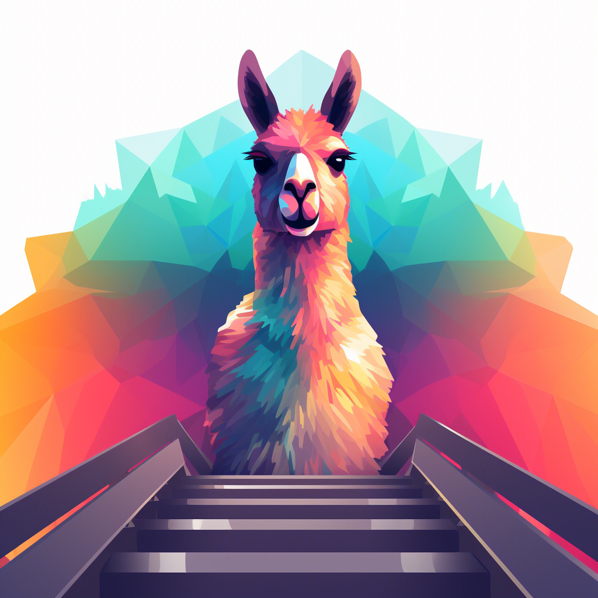

<!-- PROJECT LOGO -->
<br />

<div align="center">
  <a href="https://github.com/OPPOMKLab/u-LLaVA">
    
  </a>

<h3 align="center">u-LLaVA: Unifying Multi-Modal Tasks via Large Language Model</h3>

  <p align="center">
    多模态多任务LLM
    <br />
    <a href="https://github.com/OPPOMKLab/u-LLaVA/blob/main/README.md"><strong> Documentation</strong></a>
      |
    <a href="https://github.com/OPPOMKLab/u-LLaVA/blob/main/README_zh.md"><strong> 中文文档 </strong></a>
    <br />
    <br />
    <a href="https://arxiv.org/abs/2311.05348">论文</a>
    ·
    <a href="https://github.com/OPPOMKLab/u-LLaVA/issues">反馈Bug</a>
    ·
    <a href="https://github.com/OPPOMKLab/u-LLaVA/issues">新特性</a>
  </p>

</div>

## 🎉 News

- **\[2024/07\]** 我们将很快更新[grounding&segmentation版ullava权重][].

- **\[2024/07\]** 336分辨率支持，MM-Bench, TextVQA, SQA, GQA 结果更新.

- **\[2024/07\]** [Salient-15k][salient_15k] 标注文件已更新.

- **\[2024/07\]** 本工作已被**ECAI 2024**接收，感谢所有前序工作！

- **\[2024/01\]** [代码][https://github.com/OPPOMKLab/u-LLaVA/] and [分割版本权重][ullava] 已开源.

- **\[2023/10\]** [论文][https://arxiv.org/abs/2311.05348] 已提交.

  

<!-- TABLE OF CONTENTS -->

<details>
  <summary>目录</summary>
  <ol>
    <li>
      <a href="#about-the-project">关于项目</a>
      <ul>
        <li><a href="#features">特色</a></li>
      </ul>
    </li>
    <li>
      <a href="#getting-started">开始</a>
      <ul>
        <li><a href="#requirements">配置要求</a></li>
        <li><a href="#datasets">数据集</a></li>
        <li><a href="#training">训练</a></li>
        <li><a href="#evaluation">测试</a></li>
      </ul>
    </li>
    <li><a href="#license">License</a></li>
    <li><a href="#citation">引用</a></li>
    <li><a href="#acknowledgments">致谢</a></li>
  </ol>
</details>


<!-- ABOUT THE PROJECT -->

## 关于项目
模型结构:

<div align="center">
    
</div>


样例：
<div align="center">
    
</div>

<div align="center">
 
</div>

<div align="center">
 
</div>


<p align="right">(<a href="#readme-top">back to top</a>)</p>

Demo即将上线。

<!-- Features -->

## 特色

**代码**

- [x] 训练Epoch量化测试

  - [x] 自定义Compute metrics，适配transformers

- [x] 混合数据集

  - [x] 数据集比例指定
  - [x] 文本数据集、图文数据集、视频文数据集

- [x] DeepSpeed

- [x] LoRA

  

**任务**

- [x] 视觉理解
  - [x] 图Captioning
  - [x] 视频Captioning
  - [x] 视觉问答 (VQA)
- [x] 分割
  - [x] 指代分割 (RES)
  - [x] 显著性目标分割
  - [x] 语义分割
- [x] 视觉Grounding
    - [x] 指代理解 (REC)

<p align="right">(<a href="#readme-top">back to top</a>)</p>

<!-- Models -->

## 模型开源

| Models  |            Images/Videos |
| :------ | -----------------------: |
| u-LLaVA | [uLLaVA Stage 2][ullava] |

<!-- GETTING STARTED -->

## 开始

<!-- Requirements -->

### 配置要求

终端运行以下命令:
```shell
pip install -r ./shells/requirements.txt
cd ./models/GroundingDINO && ./install.sh && cd ../..
```
指令意义：
1. 安装ullava所需库: `pip install -r requirements.txt`
2. 构建GroundingDINO cuda依赖库: `cd ./models/GroundingDINO && ./install.sh && cd ../..`, 
    如果之前未配置，可能会出现以下告警 `UserWarning: Failed to load custom C++ ops. Running on CPU mode Only!
    warnings.warn("Failed to load custom C++ ops. Running on CPU mode Only!")`
3. 如果GroundingDINO出现问题，可以关闭掉代码中所有GroundingDINO相关模块，以纯分割形式运行

<!-- Datasets -->

## 数据集

我们对使用到的数据集的标注文件进行了重构，方便训练和理解，请下载我们重构后的标注文件。

**下载链接**: [ullava modified annotations][ullava_database], [LLaVA pretrain annotations][llava_cc3m_anno] and [LLaVA finetuning annotaions][llava_instruct_150k]

**训练图像存储示例** (后表中有图像文件下载链接):

```
image_root
├─ade20k
│  ├─annotations
│  └─images
├─coco2014
│  ├─test2014
│  ├─train2014
│  └─val2014
├─coco2017
│  ├─annotations
│  ├─train2017
│  └─val2017
├─cocostuff
│  ├─train2017
│  └─val2017
├─LLaVA-CC3M-Pretrain-595K
│  └─images
├─saiapr_tc-12
│  ├─00
│  └─01
└─vlpart
    ├─paco
    │  └─annotations
    └─pascal-part
        ├─Annotations_Part
        ├─examples
        └─VOCdevkit
```

其中 ade20k 由 ADEChallengeData2016.zip 解压并重命名，cocostuff由 stuffthingmaps_trainval2017.zip解压并重命名。

### Stage I: 预训练
| Dataset | Images/Videos | Annotations |
| :-----| ----: | :----: |
| LLaVA CC3M | [LLaVA-CC3M-Pretrain-595K/image.zip][llava_cc3m_image] | [chat.json][llava_cc3m_anno] |
| TGIF | [TGIF - Quark Drive ][tgif_quark] | [tgif.json][ullava_database] |

请注意：我们对TGIF数据集进行了重命名并剔除了无效样本，以方便训练，但请大家遵循原始TGIF数据集的LICENSE。

### Stage II: 微调
| Dataset | Images | Annotations |
| :-----| ----: | :----: |
| LLaVA Instruction 150K | [coco2017][coco2014_images] | [llava_instruct_150k.json][llava_instruct_150k] |
| RefCOCO | [coco2014][coco2014_images] | [refcoco_train.json][ullava_database] |
| RefCOCOg | [coco2014][coco2014_images] | [refcocog_train.json][ullava_database] |
| RefCOCO+ | [coco2014][coco2014_images] | [refcoco+_train.json][ullava_database] |
| RefCLEF | [saiapr_tc-12][saiapr_tc-12] | [refclef_train.json][ullava_database] |
| ADE20K | [ade20k][ade20k] | [ade20k.json][ullava_database] |
| COCO Stuff | [cocostuff][coco_stuff] | [cocostuff.json][ullava_database]  |
| VOC2010 | [voc2010][voc2010] | [pascal_part.json][ullava_database] |
| PACO LVIS  | [paco][paco] | [paco_lvis.json][ullava_database] |
| Salient 15K | coming soon | coming soon |

数据集配置示例

```yaml
dataset:
  llava:
    data_type: 'image'
    image_token_len: 256
    build_info:
      anno_dir: '/path_to_annotations/llava_instruct_150k.json'
      image_dir: '/path_to_image_root/coco2017/train2017'
      portion: 1.0
    vis_processor: 'clip_image'

  refcoco+:
    data_type: 'image'
    image_token_len: 256
    build_info:
      anno_dir: '/path_to_annotations/refcoco+_train.json'
      image_dir: '/path_to_image_root/coco2014'
      template_root: './datasets/templates/SEG.json'
      portion: 1.0
    vis_processor: 'clip_image'
```

<!-- Training -->

## 训练

### Stage I: 预训练

1. 准备开源模型

| Foundation model | Version | Path |
| :-----| ----: | :----: |
| Vicuna 7B HF | V1.1 | [vicuna_7b_v1.1][vicuna_7b_v1.1] |
| LLaMA2 7B HF | - | [meta-llama/Llama-2-7b-hf][llama2_7b] |
| SAM | ViT-H | [sam_vit_h_4b8939.pth][sam_vit_h] |
| GroundingDINO | swint_ogc | [groundingdino_swint_ogc.pth][groundingdino_swint_ogc] |

*Note:*

*- LLaMA2 由 `bf16`训练, 如果以 `fp16`进行一阶段训练时，可能出现收敛错误.*

*- LLaMA2 默认的 `tokenizer.legacy` 为 False, 因此使用某些 conversation 模板时可能出现编解码错误.* 

*- 更正: 论文中使用的基模型为 `Vicuna-v1.1`, 而不是LLaMA2，非常抱歉出现了笔误.*


2. 准备数据集
3. 设置配置文件
```text
configs/train/ullava_core_stage1.yaml
```
请注意配置好所有图像路径和模型路径.
4. 多GPU训练Stage I
```shell
./shells/pretrain.sh
```
或者单 GPU `python train_ullava_core.py --cfg_path './configs/train/ullava_core_stage1.yaml'` .

第一阶段使用 4 个 A100 80G 和 bf16，1 个周期花费约 6 小时。 然后你可以在output_dir找到训练好的模型，
例如，“./exp/ullava_core_7b”

### Stage II: 微调

Stage I 完成之后，即可以进行下一阶段的训练，
1. 准备数据集
2. 设置配置文件
```text
configs/train/ullava_stage2_lora.yaml (for lora)
configs/train/ullava_stage2.yaml (for non lora)
```
3. 多GPU训练
```shell
./shells/finetune.sh
```
或者单GPU LoRA微调：python train_ullava.py --cfg_path './configs/train/ullava_stage2_lora.yaml'` .


### 常见问题
Q1: 使用了哪种conversation 模板?

A1: Stage I: 'conv_simple'. Stage II: 'conv_sep2'

Q2: 什么时候使用LoRA?

A2: Stage I: 我们未使用. Stage II: 根据您的设备.

<p align="right">(<a href="#readme-top">back to top</a>)</p>

<!-- Evaluation -->

## 测试

### 批量量化测试

1. 配置文件
```text
configs/eval/eval_res.ymal (for RES task)
configs/eval/eval_rec.ymal (for REC task)
configs/eval/eval_salient.ymal (for Salinet segmentation task)
```
2. 运行
```text
python evaluation/eval_ullava.py --cfg_path './configs/eval/eval_res.yaml' (for RES)
python evaluation/eval_ullava_grounding.py --cfg_path './configs/eval/eval_rec.yaml' (for REC)
python evaluation/eval_ullava.py --cfg_path './configs/eval/eval_salient.yaml' (for Salinet)
```


<p align="right">(<a href="#readme-top">back to top</a>)</p>

<!-- Qualitative Evaluation -->

### 定性测试

调整 `evaluation/inference_ullava_core.py` 和`evaluation/inference_ullava.py` 的argparser配置，进行一阶段和二阶段的定性测试

```text
python evaluation/eval_ullava.py
python evaluation/eval_ullava_grounding.py 
```

<p align="right">(<a href="#readme-top">back to top</a>)</p>

<!-- LICENSE -->

## License

Distributed under the Apache License. See `LICENSE` for more information.

<p align="right">(<a href="#readme-top">back to top</a>)</p>

<!-- Citation -->

## 引用

```
@inproceedings{xu2024ullava,
  title={u-LLaVA: Unifying Multi-Modal Tasks via Large Language Model},
  author={Xu, Jinjin and Xu, Liwu and Yang, Yuzhe and Li, Xiang and Wang, Fanyi and Xie, Yanchun and Huang, Yi-Jie and Li, Yaqian},
  booktitle={Proceedings of the 27th European Conference on Artificial Intelligence},
  year={2024}
}
```

<p align="right">(<a href="#readme-top">back to top</a>)</p>

<!-- TODO -->

## 待办

- [ ] Visual Segmentation
  - [ ] Instance Segmentation

<p align="right">(<a href="#readme-top">back to top</a>)</p>

<!-- ACKNOWLEDGMENTS -->
## 致谢
由衷感谢以下开源工作的贡献，且本工作由上海市白玉兰浦江人才计划支持 (项目编号：23PJ1421800)。

* [LLaVA](https://github.com/haotian-liu/LLaVA)
* [LISA](https://github.com/dvlab-research/LISA)
* [VideoLLaMA](https://github.com/DAMO-NLP-SG/Video-LLaMA)
* [Shikra](https://github.com/shikras/shikra)
* [SAM](https://github.com/facebookresearch/segment-anything)
* [GroundingDINO](https://github.com/IDEA-Research/GroundingDINO)

<p align="right">(<a href="#readme-top">back to top</a>)</p>


See the [open issues](https://github.com/OPPOMKLab/u-LLaVA/issues) for a full list of proposed features (and known issues).

<p align="right">(<a href="#readme-top">back to top</a>)</p>

<!-- MARKDOWN LINKS & IMAGES -->
<!-- https://www.markdownguide.org/basic-syntax/#reference-style-links -->

[llava_cc3m_image]: https://huggingface.co/datasets/liuhaotian/LLaVA-CC3M-Pretrain-595K/blob/main/images.zip
[llava_cc3m_anno]: https://huggingface.co/datasets/liuhaotian/LLaVA-CC3M-Pretrain-595K/blob/main/chat.json
[llava_instruct_150k]: https://huggingface.co/datasets/liuhaotian/LLaVA-Instruct-150K
[coco2014_images]: https://cocodataset.org/#download
[coco2017_images]: https://cocodataset.org/#download
[ullava_database]: https://huggingface.co/datasets/jinxu95/ullava/tree/main
[saiapr_tc-12]: https://web.archive.org/web/20220515000000/http://bvisionweb1.cs.unc.edu/licheng/referit/data/images/saiapr_tc-12.zip
[ade20k]: http://data.csail.mit.edu/places/ADEchallenge/ADEChallengeData2016.zip
[coco_stuff]: http://calvin.inf.ed.ac.uk/wp-content/uploads/data/cocostuffdataset/stuffthingmaps_trainval2017.zip
[voc2010]: http://host.robots.ox.ac.uk/pascal/VOC/voc2010/VOCtrainval_03-May-2010.tar
[paco]: https://dl.fbaipublicfiles.com/paco/annotations/paco_lvis_v1.zip
[tgif_quark]: https://pan.quark.cn/s/4440590bceed
[llama2_7b]: https://huggingface.co/meta-llama/Llama-2-7b-hf
[vicuna_7b_v1.1]: https://huggingface.co/lmsys/vicuna-7b-v1.1
[sam_vit_h]: https://dl.fbaipublicfiles.com/segment_anything/sam_vit_h_4b8939.pth
[groundingdino_swint_ogc]: https://github.com/IDEA-Research/GroundingDINO/releases/download/v0.1.0-alpha/groundingdino_swint_ogc.pth
[ullava]: https://huggingface.co/jinxu95/ullava
